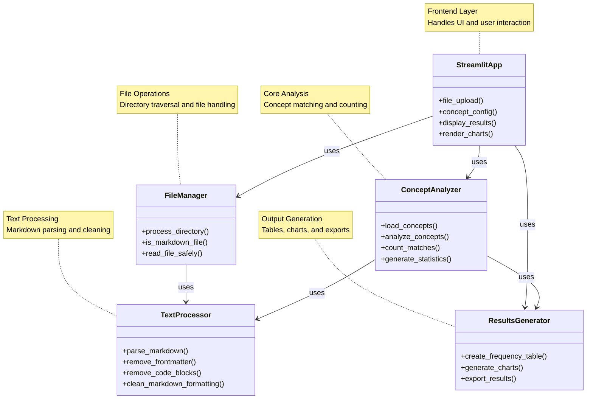

# Safari Assistant - Architecture Specification

## UML Architecture Diagram

```mermaid
classDiagram
    class StreamlitApp {
        +file_upload()
        +concept_config()
        +display_results()
        +render_charts()
    }
    
    class FileManager {
        +process_directory()
        +is_markdown_file()
        +read_file_safely()
    }
    
    class TextProcessor {
        +parse_markdown()
        +remove_frontmatter()
        +remove_code_blocks()
        +clean_markdown_formatting()
    }
    
    class ConceptAnalyzer {
        +load_concepts()
        +analyze_concepts()
        +count_matches()
        +generate_statistics()
    }
    
    class ResultsGenerator {
        +create_frequency_table()
        +generate_charts()
        +export_results()
    }
    
    StreamlitApp --> FileManager : uses
    StreamlitApp --> ConceptAnalyzer : uses
    StreamlitApp --> ResultsGenerator : uses
    FileManager --> TextProcessor : uses
    ConceptAnalyzer --> TextProcessor : uses
    ConceptAnalyzer --> ResultsGenerator : uses
    
    note for StreamlitApp "Frontend Layer<br/>Handles UI and user interaction"
    note for FileManager "File Operations<br/>Directory traversal and file handling"
    note for TextProcessor "Text Processing<br/>Markdown parsing and cleaning"
    note for ConceptAnalyzer "Core Analysis<br/>Concept matching and counting"
    note for ResultsGenerator "Output Generation<br/>Tables, charts, and exports"
```
